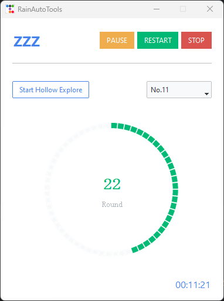
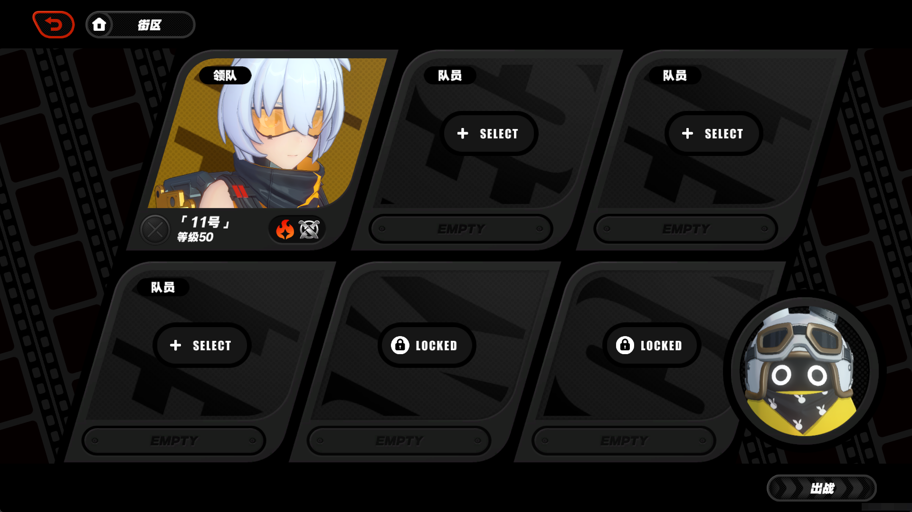

# 绝区零 全自动零号业绩

## 原理
利用 `cnocr` 和  `pyautogui + opencv` 实现目标识别，配合 `yaml脚本` 实现自动化探索

## 说明
绝区零空洞每周需要反复刷取。`So Tired !`   
于是有了自动探索零号空洞，获取全部零号业绩  
由于系统限制一周业绩获取上限大约在 `1k` 左右，一次探索获取 `20` 业绩，应用会在第 `50` 次探索后自动停止



## 安装环境

1. python 环境，python version >= 3.10.0，安装方式参考 [python官网](https://www.python.org/downloads/)
2. poetry 工具，安装方式参考 [poetry官网](https://python-poetry.org/docs/#installation)

## 安装应用

进入项目根目录，以 *__管理员权限__* 启动命令行
### 安装依赖
```shell
poetry install
```
### 运行 PoeTry Shell
```shell
poetry shell
```
### 运行 ZZZ Panel
```shell
python -m autozzz.zzz_panel
```

## 游戏配置

### 设置第二攻击键位为 `y`  
  

### 确认在 `旧都列车·前线` 副本中，只有一个角色上阵


### 确认在 `零号空洞-作战机略` 中，已获取 `炸弹补给`


### 上述条件满足后，点击 `Start Hollow Explore`，就开启自动探索了🍜🍜🍜

## 免责声明

- 本软件旨在为用户提供合法的游戏辅助功能，以增强游戏体验。用户必须遵守所有适用的法律、法规以及相关游戏的服务条款。
- 本软件开源、免费，仅供学习交流使用，禁止用于商业用途。开发者团队拥有本项目的最终解释权。
- 本软件不对用户使用本软件的行为负责，包括但不限于用户使用本软件造成的游戏账号封禁、游戏数据丢失等情况。  


- This software aims to provide users with legitimate game assistance features to enhance their gaming experience. Users must comply with all applicable laws, regulations, and relevant game terms of service.  
- This software is open source, free, for learning and communication purposes only, and is prohibited from being used for commercial purposes. The developer team has the final interpretation right of this project.  
- This software is not responsible for the user's use of this software, including but not limited to game account bans, game data loss, and other situations caused by the user's use of this software.  