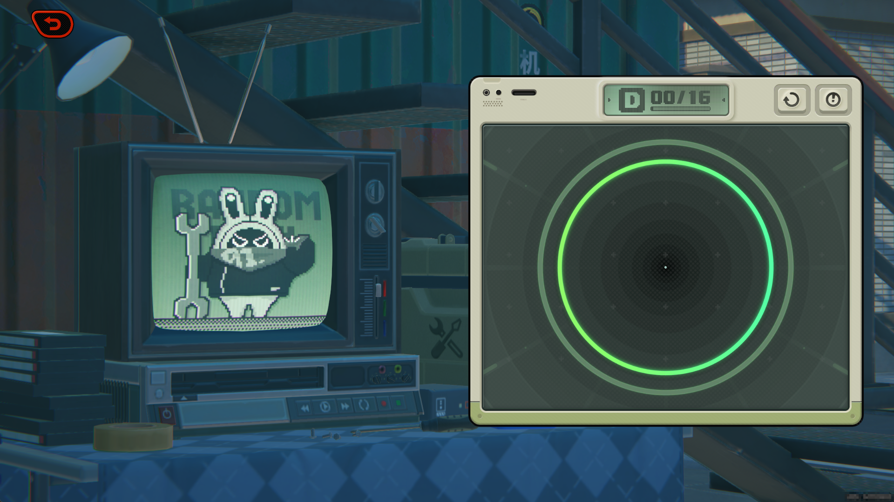
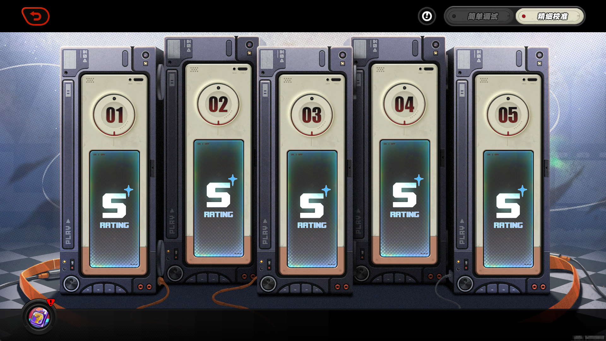

<div>
  <h1>
  <a href="https://github.com/rainlf/auto-zzz">Auto ZZZ</a>
  </h1>
</div>

## 功能

- [使用说明](https://github.com/rainlf/auto-zzz#%E4%BD%BF%E7%94%A8%E8%AF%B4%E6%98%8E)：使用前必看，不然无法正常使用
- [自动零号业绩](https://github.com/rainlf/auto-zzz#%E8%87%AA%E5%8A%A8%E9%9B%B6%E5%8F%B7%E4%B8%9A%E7%BB%A9)：自动刷取零号空洞零号业绩 (`python -m autozzz.hollow`)
- [自动小游戏-金牌售后](https://github.com/rainlf/auto-zzz#%E8%87%AA%E5%8A%A8%E5%B0%8F%E6%B8%B8%E6%88%8F-%E9%87%91%E7%89%8C%E5%94%AE%E5%90%8E) ：自动通关游戏活动，金牌售后音游小游戏 (`python -m autozzz.gold_service`)

## 使用说明

### 安装环境

1. python 环境，python version >= 3.10.0，安装方式参考 [python官网](https://www.python.org/downloads/)
2. poetry 工具，安装方式参考 [poetry官网](https://python-poetry.org/docs/#installation)

### 安装项目

1. 进入项目根目录，以 *__管理员权限__* 启动命令行
2. 安装依赖 `poetry install`
3. 进入工作环境 `poetry shell`

### 运行模块

1. 执行对应模块，详见功能模块说明

## 自动零号业绩

### 使用方法

1. 设置第二攻击键位为 `y`
   
2. 确认在 `旧都列车·前线` 副本中，只有一个角色上阵
   
3. 确认在 `零号空洞-作战机略` 中，已获取 `炸弹补给`
   
4. 运行模块，点击 `Start Hollow Explore` 🍜🍜🍜

```shell
python -m autozzz.hollow
```


## 自动小游戏-金牌售后

### 使用方法

1. 运行模块，进入小游戏，按 `+` 键开始辅助， 按 `-` 键结束辅助

```shell
python -m autozzz.gold_service
```




## 免责声明

- 本软件旨在为用户提供合法的游戏辅助功能，以增强游戏体验。用户必须遵守所有适用的法律、法规以及相关游戏的服务条款。
- 本软件开源、免费，仅供学习交流使用，禁止用于商业用途。开发者团队拥有本项目的最终解释权。
- 本软件不对用户使用本软件的行为负责，包括但不限于用户使用本软件造成的游戏账号封禁、游戏数据丢失等情况。


- This software aims to provide users with legitimate game assistance features to enhance their gaming experience. Users
  must comply with all applicable laws, regulations, and relevant game terms of service.
- This software is open source, free, for learning and communication purposes only, and is prohibited from being used
  for commercial purposes. The developer team has the final interpretation right of this project.
- This software is not responsible for the user's use of this software, including but not limited to game account bans,
  game data loss, and other situations caused by the user's use of this software.  